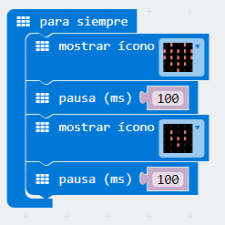

## Reto 2 Animando los iconos. {#reto-2-animando-los-iconos}

La animación es una técnica que logra crear sensación de movimiento a imágenes estáticas. Se consigue mediante una secuencia de imágenes ordenadas, que al ser mostradas consecutivamente,  consiguen generar la ilusión visual de movimiento.

### Objetivo. {#objetivo}

Se propone, que al conectar la micro:BIT, se muestre en el panel LED un corazón que late.
 https://www.youtube.com/watch?v=Cf2ov3A-ICE&feature=youtu.be 

### Descripción del código. {#descripci-n-del-c-digo}

Se usará el evento “para siempre”, situado en la categoría Básico..

Situar en el interior el bloque anterior la instrucción mostrar icono, usar el llamado corazón.

Agregar el bloque pausa ms (100) localizado en la categoría Básico.

Repetir los dos bloques anteriores, pero seleccionando el icono “corazón pequeño”.

De forma inmediata se visualiza en el simulador un corazón que simula latir.

###Simulador

<iframe style="position:absolute;top:0;left:0;width:100%;height:100%;" src="https://makecode.microbit.org/---run?id=_fxMcfc0KHUmd" allowfullscreen="allowfullscreen" sandbox="allow-popups allow-forms allow-scripts allow-same-origin" frameborder="0"></iframe>

### Propuesta. {#propuesta}

Hacer un código que muestre la animación de una tijera cortando.