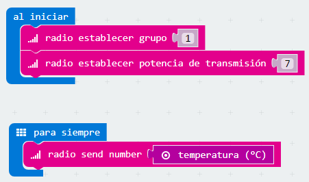
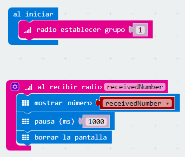

##Reto 15 Sensor inalámbrico.

En algunas situaciones se puede dar el caso de que no se pueda tener conectado el sensor con la unidad receptora de datos mediante cable. Cuando esta situación se presenta una opción es usar sensores inalámbricos.

Usar sensores inalámbricos aporta numerosas ventajas. Entre ellas destacan la seguridad, la centralización de la monitorización y el ahorro de costes por no tener que cablear la instalación.

Un sensor inalámbrico está compuesto por el sistema recolector de datos, un sistema de emisión de datos y una fuente de alimentación. Lo más habitual es que la transmisión de datos sea mediante radiofrecuencia. Por otro lado, se encuentra un sistema receptor de datos conectado al sistema de almacenamiento y procesado.

### Objetivo. {#objetivo}

Diseñar un sistema inalámbrico de recolección de datos. La micro:BIT emisora se situará en el interior de una nevera y emitirá la temperatura. La unidad exterior mostrará el valor de la temperatura.

### Descripción del código. {#descripci-n-del-c-digo}

Se deberán crear dos códigos, uno para la micro:BIT emisora y otro para la receptora.

Para que las tarjetas se puedan comunicar entre sí, ambas deben estar en el mismo grupo de comunicación. También se debe emitir con la máxima potencia para evitar la atenuación que sufre la tarjeta emisora al encontrarse dentro de la nevera. Por este motivo, se deberá usar el bloque radio establecer potencia de transmisión situado en la categoría Radio y usar el máximo valor que es 7\. Se recomienda usar el evento al iniciar para establecer el grupo de comunicación y asignar la potencia de transmisión.

micro:BIT emisora:

Tras establecer el grupo de emisión en 1 y poner la potencia de emisión al máximo, se enviará el valor de la temperatura mediante el bloque radio send number.

micro:BIT receptora:

La cadena enviada se guarda en la micro:BIT receptora en una variable que por defecto se llama “receivedNumber”. Se usará el bloque mostrar número, para visualizar la temperatura medida en la nevera. Tras un segundo se apagará el panel LED. No olvidar establecer al inicio el grupo de comunicación.

El código de la tarjeta receptora quedaría de la siguiente forma:

### Propuesta. {#propuesta}

Se propone mostrar una animación en el panel de la micro:BIT emisora, que confirme que el programa está en marcha.